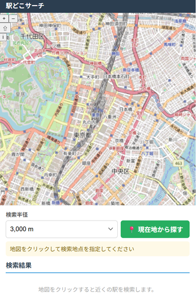

# Nearest Station Map

OpenStreetMap をベースにした「指定地点から近い最寄り駅を表示する Web アプリ」です。地図上の任意地点をクリックすると、その周辺の駅を Overpass API で検索し、距離が近い順に一覧表示します。

https://yutaka-art.github.io/nearest-station-map/



## アプリ概要

- 地図をクリック → 周辺駅を距離順に最大 10 件表示
- 検索半径: 1,000 / 2,000 / 3,000 / 5,000 m から選択可能
- 現在地（Geolocation API）からの検索に対応
- 駅マーカーをクリックするとポップアップで駅名・距離を表示
- PC: 地図＋右サイドパネル / スマートフォン: 地図＋下部パネルのレスポンシブ対応

## 技術スタック

| 項目 | 内容 |
|------|------|
| フレームワーク | Vue 3 (Composition API) |
| 言語 | TypeScript |
| ビルドツール | Vite |
| 地図ライブラリ | OpenLayers |
| 背景地図 | OpenStreetMap 標準タイル |
| 駅データ | Overpass API |
| スタイル | プレーン CSS (Scoped) |
| 状態管理 | なし（Composable のみ） |

## セットアップ手順

```bash
# リポジトリをクローン
git clone https://github.com/<your-username>/nearest-station-map.git
cd nearest-station-map

# 依存パッケージをインストール
npm install
```

## 開発サーバー起動手順

```bash
npm run dev
```

ブラウザで `http://localhost:5173` を開いてください。

## ビルド手順

```bash
npm run build
```

`dist/` ディレクトリに静的ファイルが生成されます。

ビルド結果の確認:

```bash
npm run preview
```

## GitHub Pages デプロイ時の注意

GitHub Pages でサブパス（例: `https://<user>.github.io/nearest-station-map/`）にデプロイする場合は、`vite.config.ts` の `base` を変更してください。

```ts
// vite.config.ts
export default defineConfig({
  plugins: [vue()],
  base: '/nearest-station-map/', // ← リポジトリ名に合わせて変更
})
```

変更後にビルドし、`dist/` の内容を `gh-pages` ブランチへプッシュすることでデプロイできます。

```bash
npm run build
# GitHub Actions や gh-pages CLI 等でデプロイ
```

## Vercel デプロイ時の注意

通常の Vite SPA としてデプロイできます。`vite.config.ts` の `base` は `/` のまま（デフォルト）で問題ありません。

1. Vercel のダッシュボードでリポジトリを Import
2. フレームワークプリセット: **Vite** を選択
3. Build Command: `npm run build`
4. Output Directory: `dist`
5. Deploy

## 駅データについて

本アプリの駅データは、国土交通省「国土数値情報（鉄道時系列データ N05）」を加工して作成した静的 JSON ファイル（`public/data/stations.json`）を使用しています。

### データ生成手順

#### 1. 元データのダウンロード

以下のページから N05（鉄道時系列データ）の ShapeFile をダウンロードしてください。

https://nlftp.mlit.go.jp/ksj/gml/datalist/KsjTmplt-N02-v3_1.html

ダウンロードしたファイルを以下のパスに配置してください。

```
data-source/
└── N05/
    ├── Station2.shp
    ├── Station2.dbf
    └── Station2.shx  （他の関連ファイルも同じフォルダへ）
```

#### 2. 依存ライブラリのインストール

```bash
pip install geopandas pyproj shapely
```

#### 3. スクリプトの実行

```bash
python tools/generate-stations.py
```

実行すると `public/data/stations.json` が生成されます。

#### 4. 生成結果の確認

スクリプトはカラム一覧・件数・重複排除結果をログ出力します。N05 のバージョンによってカラム名が異なる場合は、`tools/generate-stations.py` 内の `COLUMN_CANDIDATES` を調整してください。

### データの利用条件

- 国土数値情報のデータは [国土数値情報ダウンロードサービス利用規約](https://nlftp.mlit.go.jp/ksj/other/yakkan.html) に従って利用してください。
- `public/data/stations.json` はアプリ配信用の派生データです。
- 商用利用を予定する場合は、元データの利用条件を必ずご確認ください。
- 元データの著作権は国土交通省に帰属します。

## OpenStreetMap / Overpass API 利用上の注意

- 本アプリは [OpenStreetMap](https://www.openstreetmap.org/) のデータを使用しています。
  © OpenStreetMap contributors, [ODbL](https://www.openstreetmap.org/copyright)
- 駅データの取得には [Overpass API](https://overpass-api.de/) を利用しています。
- 過度なリクエストはサーバーに負荷をかけますので、**ユーザー操作をトリガーにした場合のみ**検索を実行する設計にしています。
- 商用利用を予定する場合は、各サービスの利用規約を確認してください。

## ディレクトリ構成

```
src/
  main.ts                     # エントリーポイント
  App.vue                     # ルートコンポーネント
  components/
    MapView.vue               # OpenLayers 地図
    SearchPanel.vue           # 検索半径・現在地ボタン
    StationList.vue           # 駅一覧パネル
  composables/
    useNearestStations.ts     # 検索ロジック（状態 + API 呼び出し）
  services/
    overpassService.ts        # Overpass API 呼び出し・クエリ生成
  utils/
    geo.ts                    # Haversine 距離計算・フォーマット
  types/
    station.ts                # Station 型定義
  styles/
    global.css                # グローバルスタイル
```

## 今後の改善案

- [ ] 検索履歴の保存（localStorage）
- [ ] 路線名・運行会社の表示（OSM タグから取得）
- [ ] マーカーのデザイン改善（SVG アイコン等）
- [ ] 地図のズームに合わせた自動再検索オプション
- [ ] PWA 対応（オフラインキャッシュ）
- [ ] 多言語対応（英語名表示）
- [ ] アクセシビリティ改善（スクリーンリーダー対応）
- [ ] E2E テストの追加
- [ ] 代替 Overpass API インスタンスのフォールバック対応
